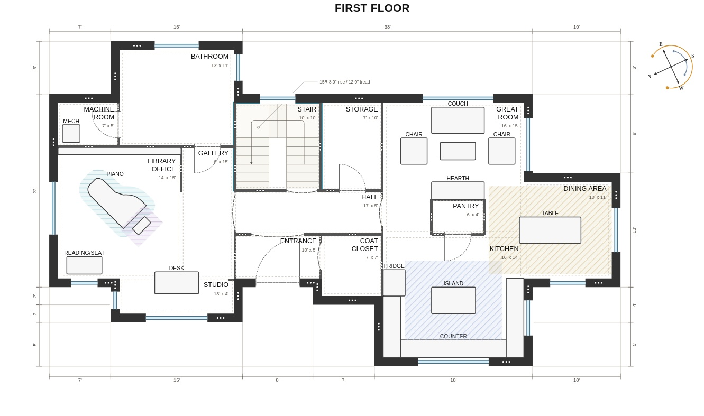

# Ridgestone Floor Plan Editor

A small web app for editing house floor plans. The representation is a DSL language in YAML.

The project has two main parts:

- a Svelte/Vite editor for inspecting and adjusting the plan visually
- a Python/FastAPI backend that loads YAML plans and renders them as SVG floor plans

Plans live in `artifacts/floorplans/`. The editor lets you select rooms, walls, openings, stairs, and features, then update the underlying YAML while seeing the rendered plan.



## Requirements

- Python 3.11 or newer
- pnpm 9

## Install

From the repository root:

```sh
python -m venv .venv
source .venv/bin/activate
pip install -e ".[dev]"
pnpm install
```

## Run The Editor

Start the API and web editor together:

```sh
pnpm dev
```

Then open:

```text
http://localhost:5173
```

The script stops both dev servers when it exits, including when you press Ctrl-C.
It keeps the existing dev reload behavior: Uvicorn reloads the API on Python changes, and Vite hot-reloads editor source changes.

If you want separate terminals, start the API in one terminal:

```sh
pnpm dev:api
```

Start the web editor in another terminal:

```sh
pnpm dev:editor
```

Then open:

```text
http://localhost:5173
```

The Vite dev server proxies `/api` requests to the FastAPI backend on `http://127.0.0.1:8000`.

## Useful Commands

Run Python tests:

```sh
pnpm test:py
```

Run editor tests:

```sh
pnpm test:web
```

Run Svelte/TypeScript checks:

```sh
pnpm lint:web
```

Build the editor:

```sh
pnpm --dir apps/editor build
```

## Project Layout

- `apps/editor/` - Svelte floor plan editor
- `src/floorplan_api/` - FastAPI backend for loading, saving, and rendering plans
- `src/floorplan_lang/` - floor plan YAML model and SVG rendering code
- `artifacts/floorplans/` - editable floor plan YAML files and generated outputs
- `assets/` - images used by docs and examples
- `tests/` - Python tests for the floor plan language and renderer
